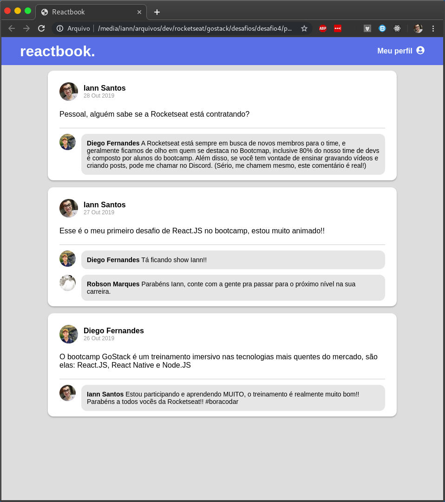

# reactbook.

Facebook timeline clone in React.js (with static data) for the study of concepts such as props and state.

_________________________________________________________________________________________________________________

Clone da timeline do Facebook em React.js (com dados estáticos) para o estudo dos conceitos como props e state.

